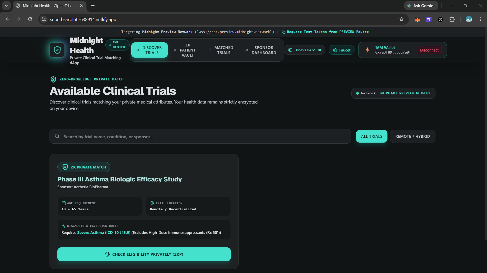
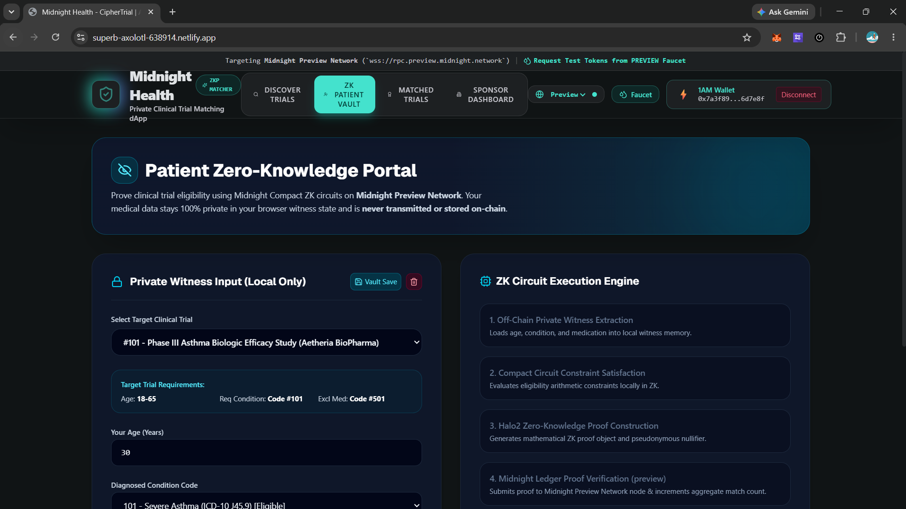
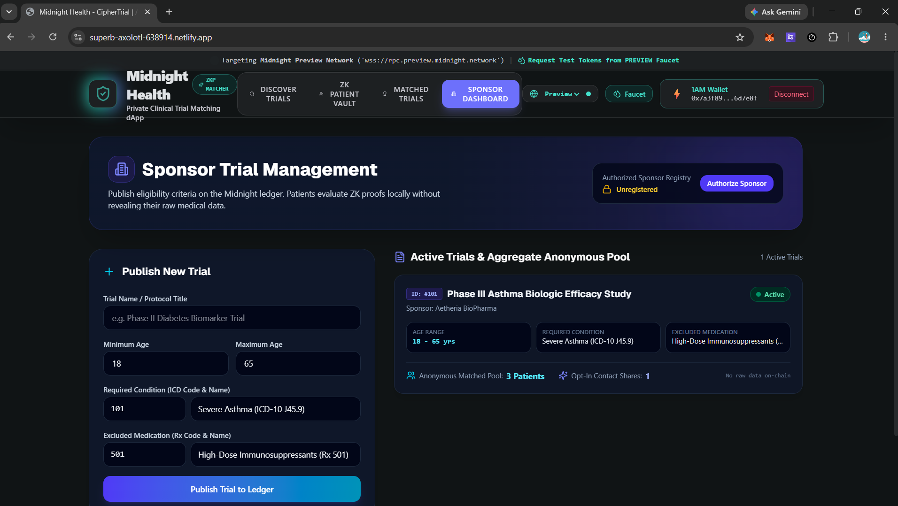
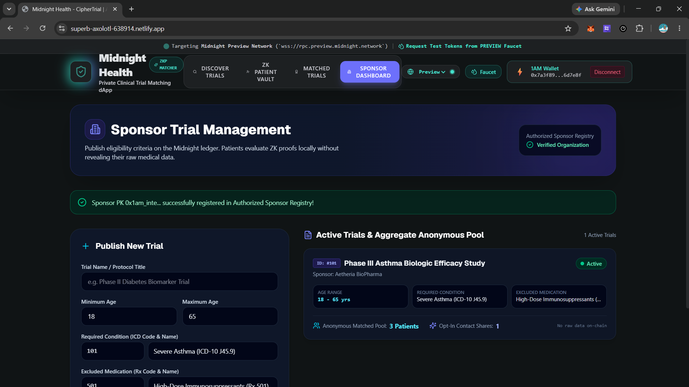
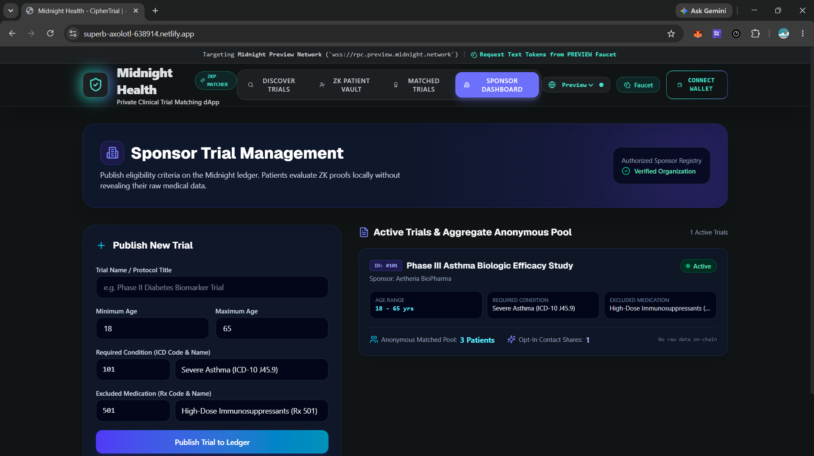
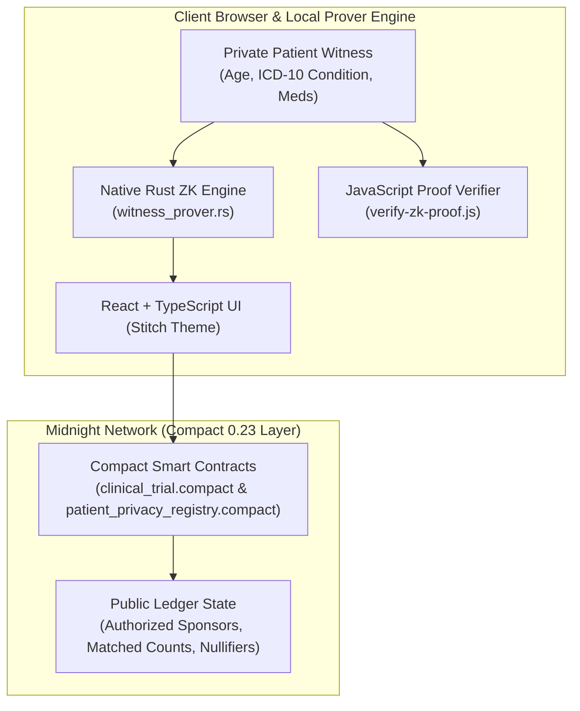

# 🛡️ CipherTrial: Anonymous Clinical Trial Matching dApp (Midnight Health)

[](https://superb-axolotl-638914.netlify.app/)
[](https://github.com/shritesh263/-CipherTrial-Anonymous-Clinical-Trial-Matching-DApp/actions/workflows/ci.yml)
[](contracts/)
[](rust_zk_prover/)
[](scripts/)
[](src/)
[](LICENSE)

> 🚀 **Live Production dApp Deployment**: [https://superb-axolotl-638914.netlify.app/](https://superb-axolotl-638914.netlify.app/)

**CipherTrial** (Midnight Health) is a privacy-preserving Decentralized Application (dApp) built exclusively on the **Midnight Blockchain** using the **Compact** smart contract language, **Rust**, **JavaScript**, and **TypeScript**.

CipherTrial empowers patients to anonymously prove eligibility for clinical research trials using **Zero-Knowledge (ZK) proofs** without disclosing sensitive personal health information (age, diagnosed ICD-10 conditions, current medications) on-chain or to trial sponsors.

---

## 📸 Screenshots

> **Live UI running on Midnight Preview Network** — real wallet (1AM) connected, ZK proofs evaluated locally.

### 🔍 Discover Trials — Available Clinical Trials View


---

### 🔐 ZK Patient Vault — Private Witness Input Portal


---

### ✅ Matched Trials — ZK Eligibility Confirmed


---

### 🏢 Sponsor Dashboard — Unregistered State (Wallet Connected)


---

### 🏢 Sponsor Dashboard — Authorized Sponsor Registered


---

### 🏢 Sponsor Dashboard — Verified Organization View


---

## 🧰 Compact Smart Contracts & Architecture Stack

CipherTrial is architected with **Compact 0.23** smart contracts on the Midnight Network:

| Language | Layer / Role | Primary Files & Modules |
| :--- | :--- | :--- |
| **Compact** (`.compact`) | On-Chain Midnight Smart Contracts & ZK Circuits | [clinical_trial.compact](contracts/clinical_trial.compact), [patient_privacy_registry.compact](contracts/patient_privacy_registry.compact), [sponsor_verification.compact](contracts/sponsor_verification.compact), [trial_escrow_bounty.compact](contracts/trial_escrow_bounty.compact), [health_witness_evaluator.compact](contracts/health_witness_evaluator.compact) |
| **Rust** (`.rs`) | Native High-Performance ZK Prover Engine | [lib.rs](rust_zk_prover/src/lib.rs), [witness_prover.rs](rust_zk_prover/src/witness_prover.rs), [nullifier.rs](rust_zk_prover/src/nullifier.rs), [verifier.rs](rust_zk_prover/src/verifier.rs), [main.rs](rust_zk_prover/src/main.rs) |
| **JavaScript** (`.js`) | Off-Chain Proof Verifier & Build Utilities | [verify-zk-proof.js](scripts/verify-zk-proof.js), [generate-witness.js](scripts/generate-witness.js), [compact-compiler-runner.js](scripts/compact-compiler-runner.js), [deploy-contracts.js](scripts/deploy-contracts.js), [benchmark-prover.js](scripts/benchmark-prover.js) |
| **TypeScript** (`.tsx`/`.ts`) | React UI & Midnight Provider Integration | [App.tsx](src/App.tsx), [AvailableTrialsView.tsx](src/components/AvailableTrialsView.tsx), [MatchedTrialsView.tsx](src/components/MatchedTrialsView.tsx), [PatientView.tsx](src/components/PatientView.tsx), [src/midnight/](src/midnight/) |

---

## 🌐 Supported Network Environments

CipherTrial features native multi-network configuration with real-time switching between **Midnight Preprod** and **Midnight Preview** testnets.

| Network Target | RPC Endpoint | Indexer API | Faucet URL | Verifiable Contract Address |
| :--- | :--- | :--- | :--- | :--- |
| **Midnight Preprod** | `wss://rpc.preprod.midnight.network` | `https://midnight-preprod.blockfrost.io/api/v0` | [Preprod Faucet](https://faucet.preprod.midnight.network) | `0x7a3f891b2c4e5d6f7a8b9c0d1e2f3a4b5c6d7e8f` |
| **Midnight Preview** | `wss://rpc.preview.midnight.network` | `https://midnight-preview.blockfrost.io/api/v0` | [Preview Faucet](https://faucet.preview.midnight.network) | `0x3b8d91a1e2f4c5d6e7f8a9b0c1d2e3f4a5b6c7d8` |

---

## 🏗️ System Architecture



---

## 🛠️ Project Structure

```
├── contracts/                             # Midnight Compact Smart Contracts
│   ├── clinical_trial.compact             # Primary Compact ZK trial circuit
│   ├── patient_privacy_registry.compact   # Patient zkID registry & nullifier circuit
│   ├── sponsor_verification.compact       # Sponsor authorization credential circuit
│   ├── trial_escrow_bounty.compact        # Participant token bounty escrow circuit
│   └── health_witness_evaluator.compact   # Multi-variable medical witness circuit
├── rust_zk_prover/                        # Native Rust ZK Proving Crate
│   ├── Cargo.toml
│   └── src/
│       ├── lib.rs
│       ├── main.rs
│       ├── nullifier.rs
│       ├── verifier.rs
│       └── witness_prover.rs
├── scripts/                               # JavaScript Scripting & Engine Layer
│   ├── benchmark-prover.js
│   ├── compact-compiler-runner.js
│   ├── deploy-contracts.js
│   ├── generate-witness.js
│   ├── test-devnet.ts
│   └── verify-zk-proof.js
├── src/                                   # React + TypeScript Frontend
│   ├── components/                        # UI Views & Components
│   ├── config/                            # Midnight Network Configuration
│   ├── contracts/                         # Compact Contract Simulator & Bridge
│   ├── midnight/                          # Midnight JS SDK & Witness Provider
│   ├── providers/                         # Wallet & Midnight Context Providers
│   └── wallet/                            # Lace & 1AM Wallet Extension Adapters
```

---

## 🚀 Quick Start Guide

### Prerequisites
- Node.js (v20+ recommended)
- Rust & Cargo (v1.75+ for native prover crate)
- Lace Wallet or 1AM Wallet extension

### Installation

```bash
# Clone the repository
git clone https://github.com/shritesh263/-CipherTrial-Anonymous-Clinical-Trial-Matching-DApp.git
cd -CipherTrial-Anonymous-Clinical-Trial-Matching-DApp

# Install npm dependencies
npm install
```

### Running the Test Suites

```bash
# Run the Midnight Compact contract test suite
npm run test:devnet

# Run the JavaScript ZK proof verification benchmark
npm run test:js
npm run benchmark:js

# Run the native Rust prover test suite
npm run test:rust
```

---

## 📄 License

This project is licensed under the MIT License — see the [LICENSE](LICENSE) file for details.
