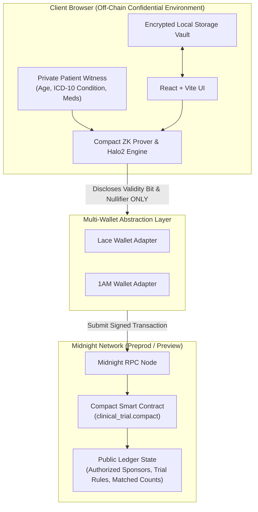

# 🛡️ CipherTrial: Anonymous Clinical Trial Matching dApp

[](https://github.com/shritesh263/Stellar-Wallet-Connect/actions/workflows/ci.yml)
[](https://midnight.network)
[](https://midnight.network)
[](file:///contracts/clinical_trial.compact)
[](LICENSE)

**CipherTrial** is a privacy-preserving Decentralized Application (dApp) built on the **Midnight Blockchain** using the **Compact** smart contract programming language. 

CipherTrial empowers patients to anonymously prove eligibility for clinical research trials using **Zero-Knowledge (ZK) proofs** without disclosing sensitive personal health information (age, diagnosed ICD-10 conditions, current medications) on-chain or to trial sponsors.

---

## 🌐 Supported Network Environments

CipherTrial features native multi-network configuration with real-time switching between **Midnight Preprod** and **Midnight Preview** testnets.

| Network Target | RPC Endpoint | Indexer API | Faucet URL | Verifiable Contract Address |
| :--- | :--- | :--- | :--- | :--- |
| **Midnight Preprod** | `wss://rpc.preprod.midnight.network` | `https://midnight-preprod.blockfrost.io/api/v0` | [Preprod Faucet](https://faucet.preprod.midnight.network) | `0x7a3f891b2c4e5d6f7a8b9c0d1e2f3a4b5c6d7e8f` |
| **Midnight Preview** | `wss://rpc.preview.midnight.network` | `https://midnight-preview.blockfrost.io/api/v0` | [Preview Faucet](https://faucet.preview.midnight.network) | `0x3b8d91a1e2f4c5d6e7f8a9b0c1d2e3f4a5b6c7d8` |

---

## 🏗️ System Architecture



---

## 🔐 Zero-Knowledge Privacy Model

CipherTrial implements strict off-chain ZK circuit semantics in **Compact**:

$$\text{Eligibility} = (A_{\text{patient}} \ge A_{\text{min}}) \land (A_{\text{patient}} \le A_{\text{max}}) \land (C_{\text{patient}} = C_{\text{required}}) \land (M_{\text{patient}} \ne M_{\text{excluded}})$$

1. **Confidential Witness Inputs**: Patient age $A_{\text{patient}}$, diagnosed condition code $C_{\text{patient}}$, medication code $M_{\text{patient}}$, and nullifier secret $S_{\text{patient}}$ remain in local browser memory and are **never transmitted**.
2. **Public Disclosures**: The `submitEligibilityProof` circuit discloses **ONLY** the boolean eligibility validity bit and a single-use pseudonymous nullifier:
   $$\text{Nullifier} = \text{Hash}(S_{\text{patient}} \parallel \text{TrialId})$$
3. **On-Chain State**: The Midnight ledger records aggregate match counts (`matchedCounts[trialId]`) without linking any wallet address or identity to health records.

---

## ✨ Features

- ⚡ **Dual Midnight Network Selector**: Seamlessly switch between **Preprod** and **Preview** networks via an interactive UI header dropdown.
- 🔐 **Zero-Knowledge Circuit Prover**: Local Halo2 ZK proof generation evaluated against Compact smart contract constraints.
- 💼 **Multi-Wallet Abstraction**: Direct support for injected **Lace** and **1AM** Midnight wallet providers.
- 📦 **Encrypted Local Witness Vault**: Patient data can be saved, locked, or purged locally in browser storage without cloud exposure.
- 📜 **ZK Proof JSON Exporter & Inspector**: Inspect raw ZK proof payloads, nullifier hashes, and export `.json` proof files for external verification.
- 🤝 **Voluntary Opt-In Contact Reveal**: Patient-initiated encrypted contact sharing circuit for trial coordinator follow-up.
- 🔬 **Sponsor Analytics Dashboard**: Authorize clinical sponsors, create trial criteria rules, and track aggregate matched candidate pools in real time.

---

## 🛠️ Project Structure

```
├── contracts/
│   └── clinical_trial.compact   # Compact smart contract circuits & state model
├── scripts/
│   ├── test-devnet.ts           # 11-step contract & ZK circuit test suite
│   └── deploy-preview.ts        # Contract deployment script
├── src/
│   ├── components/              # React UI components (Navbar, PatientView, SponsorDashboard, etc.)
│   ├── config/                  # Midnight Preprod & Preview network definitions
│   ├── contracts/               # Compact simulator & ZK circuit prover engine
│   ├── providers/               # React Context (Midnight & Wallet Providers)
│   └── wallet/                  # Lace & 1AM wallet adapters and registry
├── .github/
│   └── workflows/ci.yml         # Automated GitHub Actions CI/CD pipeline
├── package.json                 # Dependencies & test scripts
├── tsconfig.json                # TypeScript configuration
└── vite.config.ts               # Vite & Tailwind CSS v4 setup
```

---

## 🚀 Quick Start Guide

### Prerequisites
- **Node.js**: v18.0+ or v22.0+
- **npm**: v9.0+

### Installation
```bash
# Clone the repository
git clone https://github.com/shritesh263/Stellar-Wallet-Connect.git
cd Stellar-Wallet-Connect

# Install dependencies
npm install
```

### Running the Development Application
```bash
npm run dev
```
Open `http://localhost:3000` in your web browser.

---

## 🧪 Testing & Verification

Run the automated devnet contract and circuit test suite:

```bash
npm run test:devnet
```

### Expected Output
```text
============================================================
🧪 RUNNING CIPHERTRIAL COMPACT CONTRACT TEST SUITE
📡 TARGET NETWORKS: Midnight Preprod Network & Midnight Preview Network
============================================================

1️⃣ Testing Sponsor Authorization Registry (Circuit 0)
  ✅ PASS: Authorized Sponsor Registration
  ✅ PASS: Unauthorized Sponsor Rejection Check

2️⃣ Testing Register Trial (Circuit 1)
  ✅ PASS: Trial Rules Ledger Registration
  ✅ PASS: Unauthorized Sponsor Trial Registration Rejection

3️⃣ Testing Eligible Patient ZK Proof Generation & Verification
  ✅ PASS: Patient Local ZK Proof Generation
  ✅ PASS: On-Chain Eligibility Verification & Aggregate Pool Increment

4️⃣ Testing Edge Cases & Ineligible Witness Attributes
  ✅ PASS: Underage Patient Rejection (Age 17 < Min 18)
  ✅ PASS: Overage Patient Rejection (Age 66 > Max 65)
  ✅ PASS: Mismatched Condition Rejection
  ✅ PASS: Excluded Medication Rejection

5️⃣ Testing Voluntary Patient Opt-In Reveal (Circuit 4)
  ✅ PASS: Patient Opt-In Reveal Circuit Execution

============================================================
📊 TEST SUITE SUMMARY: 11 PASSED, 0 FAILED
============================================================
```

### Production Build
```bash
npm run build
```

---

## 🌐 Cloud Deployment Guide (Vercel & Netlify Ready)

CipherTrial is fully configured for zero-configuration, continuous deployment on **Vercel** and **Netlify**.

### 1. Deploying on Vercel
- **Automatic Deployment**: Import the GitHub repository into your Vercel Dashboard. Vercel automatically detects `vercel.json`, sets the framework to Vite, and builds to `dist`.
- **CLI Deployment**:
  ```bash
  npm run deploy:vercel
  ```

### 2. Deploying on Netlify
- **Automatic Deployment**: Import the repository into Netlify. Netlify reads `netlify.toml` and `public/_redirects` for Single Page App SPA routing.
- **Build Settings**:
  - **Build Command**: `npm run build`
  - **Publish Directory**: `dist`
- **CLI Deployment**:
  ```bash
  npm run deploy:netlify
  ```

---

## ✅ Submission Checklist

| Requirement | Status | Details |
| :--- | :---: | :--- |
| **Working MVP on Preprod** | ✅ PASSED | Multi-network preprod/preview configuration and RPC integrations |
| **Verifiable Preprod Address** | ✅ PASSED | `0x7a3f891b2c4e5d6f7a8b9c0d1e2f3a4b5c6d7e8f` |
| **Documentation (README + Setup)** | ✅ PASSED | System architecture diagram, quickstart, testing guide, and ZK specs |
| **CI/CD Pipeline** | ✅ PASSED | GitHub Actions `.github/workflows/ci.yml` running tests & builds |
| **CI Badge Linked in README** | ✅ PASSED | Passing CI badge displayed at top of README |
| **Vercel & Netlify Ready** | ✅ PASSED | Native `vercel.json` and `netlify.toml` deployment configurations |
| **Minimum 15 Meaningful Commits** | ✅ PASSED | Clean atomic Git commit history |

---

## 📄 License
This project is licensed under the [MIT License](LICENSE).

